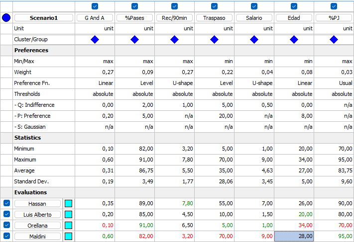
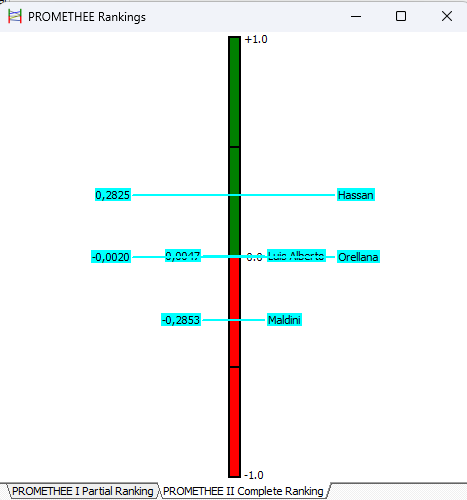
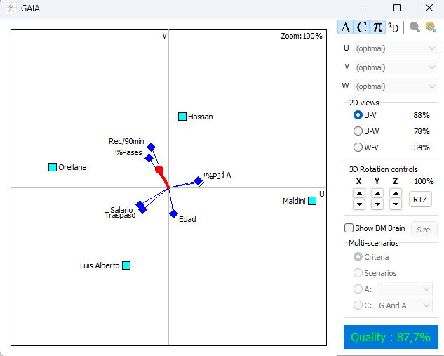

---
output:
  pdf_document: default
  html_document: default
---
# Trabajo 2: Análisis comparativo de centrocampistas para acometer un fichaje de cara a la próxima Temporada
## 1 Introducción
En este trabajo tendrá como fin elegir y justificar qué centrocampista debe elegir la dirección deportiva de un equipo de fútbol para reforzar su plantilla de cara a la próxima temporada.

Para ello se deberán analizar diversos criterios, como el rendimiento deportivo, el costo económico que debe asumir el club para su fichaje, la edad del jugador y el estado físico del jugador.

## 2 Jugadores, Criterios y Matriz de Decisión
La dirección deportiva del equipo ha seleccionado a 4 candidatos a fichar, a los que se les han evaluado diferentes cualidades y atribrutos:

1.Rendimiento Deportivo: Se tiene en cuenta las participaciones de gol por partido, el porcentaje de acierto de pases y las recuperaciones cada 90 minutos jugados.

2.Coste Económico: Se valora el coste de efectuar el fichaje y el salario del jugador al año

3.Edad: Se considera la edad del jugador, ya que a mayor edad, menor proyección deportiva y mayor riesgo de lesiones. Tendremos en cuenta el porcentaje de partidos jugados en la anterior campaña, para evaluar así su condición física.

Una vez definidos los criterios, se ha elaborado la siguiente matriz de decisión, donde se muestran los valores de cada jugador en cada uno de los criterios mencionados anteriormente:
$$
\mathbf{X} = \left(
\begin{array}{l|ccccccc}
\multicolumn{1}{c|}{\text{Jugadores}} & \text{G\&A} & \text{\%Pases} & \text{Rec/90min} & \text{Traspaso} & \text{Salario} & \text{Edad} & \text{\%PJ} \\
\hline
\text{Hassan} & 0.35 & 89 & 7.8 & 55 & 7.0 & 26 & 90 \\
\text{Luis Alberto} & 0.20 & 85 & 4.5 & 10 & 1.5 & 20 & 80 \\
\text{Orellana} & 0.10 & 91 & 6.5 & 5 & 1.0 & 34 & 70 \\
\text{Maldini} & 0.60 & 82 & 3.2 & 70 & 9.0 & 28 & 95
\end{array}
\right)
$$

## 3 Análisis con AHP
### 3.1 AHP con R
#### 3.1.1 Definición de las matrices de comparación entre criterios y subcriterios
```{r include=FALSE}
source("Funciones_Multicriterio.R")
```

```{r echo=FALSE}
# Criterios Principales: C1:Rendimiento, C2:Coste, C3:Físico
nombres_cri_princ <- c("Rendimiento", "Coste", "Físico")
# Asunción de la Dirección: C1(Rend) > C2(Costo) > C3(Pot)
# C1 vs C2 = 3 (Mod. Mejor); C1 vs C3 = 5 (Fuerte); C2 vs C3 = 3 (Mod. Mejor)
vector_val_nivel1 <- c(3, 5, 3) 
matriz_nivel1 <- multicriterio.crea.matrizvaloraciones_mej(
  vector_val_nivel1, 
  numalternativas = 3, 
  v.nombres.alternativas = nombres_cri_princ
)

# Subcriterios C1
nombres_subcri_c1 <- c("G&A", "%Pases", "Rec/90min")
# Asunción: G&A (3) > %Pases (1/3); G&A = Rec/90min (1)
vector_val_c1 <- c(3, 1, 1/3)
matriz_nivel_c1 <- multicriterio.crea.matrizvaloraciones_mej(
  vector_val_c1,
  numalternativas = 3,
  v.nombres.alternativas = nombres_subcri_c1
)

# Subcriterios C2
nombres_subcri_c2 <- c("Traspaso", "Salario")
# Asunción: Fichaje (5) >> Salario
vector_val_c2 <- c(5) 
matriz_nivel_c2 <- multicriterio.crea.matrizvaloraciones_mej(
  vector_val_c2, 
  numalternativas = 2,
  v.nombres.alternativas = nombres_subcri_c2
)

# Subcriterios C3
nombres_subcri_c3 <- c("Edad", "%PJ")
# Asunción: Edad (3) > %PJ
vector_val_c3 <- c(3)
matriz_nivel_c3 <- multicriterio.crea.matrizvaloraciones_mej(
  vector_val_c3, 
  numalternativas = 2,
  v.nombres.alternativas = nombres_subcri_c3
)

```

```{r echo=FALSE}
library(knitr)

cat("\n Matrices de Comparación AHP\n")
cat("\n Matriz de Comparación de Criterios\n")
print(knitr::kable(matriz_nivel1))


cat("\n Matriz de Comparación de Subcriterios del Rendimiento\n")
print(knitr::kable(matriz_nivel_c1))

cat("\n Matriz de Comparación de Subcriterios del Coste\n")
print(knitr::kable(matriz_nivel_c2))

cat("\n Matriz de Comparación de Subcriterios del Físico\n")
print(knitr::kable(matriz_nivel_c3))
```

#### 3.1.2 Cálculo AHP Unificado de Pesos Globales Finales
```{r ahp-calculo-unificado-final, echo=FALSE, results='asis'}
# --- 1. CÁLCULO AHP NIVEL 1 (Sección 3.2) ---
# Se asume que matriz_nivel1 está definida en un chunk anterior.

# Definición de nombres (necesarios para la matriz de pesos final)
nombres_cri_princ <- c("Rendimiento", "Coste", "Físico") 

# Cálculo del Nivel 1
res_principales <- multicriterio.metodoAHP.variante3.basico(matriz_nivel1)
pesos_criterios <- res_principales$valoraciones.ahp

# --- 2. CÁLCULO AHP NIVEL 2 (Subcriterios) ---

# Ejecución de los cálculos de Nivel 2
res_c1 <- multicriterio.metodoAHP.variante3.basico(matriz_nivel_c1)
res_c2 <- multicriterio.metodoAHP.variante3.basico(matriz_nivel_c2)
res_c3 <- multicriterio.metodoAHP.variante3.basico(matriz_nivel_c3)

# --- 3. CONSTRUCCIÓN Y CÁLCULO DE PESOS GLOBALES ---

nombres_subcri_todos <- c("G&A", "%Pases", "Rec/90min",
                          "Traspaso", "Salario", "Edad", "%PJ")

# Construcción de la matriz de pesos locales
matriz_pesos_final <- matrix(
  0,
  nrow = 3,
  ncol = 7,
  dimnames = list(nombres_cri_princ, nombres_subcri_todos)
)

# Rellenar la matriz de pesos locales
matriz_pesos_final[1, 1:3] <- res_c1$valoraciones.ahp
matriz_pesos_final[2, 4:5] <- res_c2$valoraciones.ahp
matriz_pesos_final[3, 6:7] <- res_c3$valoraciones.ahp

# Cálculo de Pesos Globales Finales
pesos_globales_finales <- multicriterio.metodoAHP.pesosglobales(
  pesos.criterios = pesos_criterios,
  matriz.pesos.locales = matriz_pesos_final
)

pesos_df <- data.frame(
  Criterio = names(pesos_globales_finales),
  Peso_Global = round(pesos_globales_finales, 4)
)
cat("\n")
print(knitr::kable(pesos_df, format = "pandoc", row.names = FALSE))
cat("\n")
```

Estos son los pesos de cada subcriterio, que reflejan su importancia relativa en la decisión final de selección del centrocampista. La suma de estos es 1

#### 3.1.3 Estudio de Inconsistencia de las Matrice
```{r echo=FALSE}
# --- 1. Calcular Inconsistencias (Se asume que las matrices están definidas) ---
incons_nivel1 <- multicriterio.metodoAHP.coef.inconsistencia(matriz_nivel1)
incons_c1 <- multicriterio.metodoAHP.coef.inconsistencia(matriz_nivel_c1)
incons_c2 <- multicriterio.metodoAHP.coef.inconsistencia(matriz_nivel_c2)
incons_c3 <- multicriterio.metodoAHP.coef.inconsistencia(matriz_nivel_c3)

# --- 2. Mostrar Resultados ---
cat("#### Resultados del Estudio de Inconsistencia (CR < 0.10)\n")

resultados_cr <- data.frame(
  Matriz = c("Criterios Principales (3x3)", "Rendimiento (C1)", 
             "Costo (C2)", "Físico (C3)"),
  CR = c(incons_nivel1$RI.coef.inconsistencia, 
         incons_c1$RI.coef.inconsistencia, 
         incons_c2$RI.coef.inconsistencia, 
         incons_c3$RI.coef.inconsistencia)
)

# Evaluar si es aceptable
resultados_cr$Estado <- ifelse(resultados_cr$CR < 0.10, "Consistente", 
                               "INCONSISTENTE")
resultados_cr$CR[is.na(resultados_cr$CR)] <- 0
resultados_cr$Estado[resultados_cr$CR == 0] <- "Consistente "
print(knitr::kable(resultados_cr, digits = 4, caption = "Ratio de Inconsistencia por Matriz"))
```
Para que sea consistente, el CR debe ser menor que 0.10. En este caso, todas las matrices cumplen con este criterio, por lo que los resultados son válidos.

### 3.2 AHP con Paquete
```{r include=FALSE}
#install.packages("devtools")
library(devtools)
#ahp_url <- "https://cran.r-project.org/src/contrib/Archive/ahp/ahp_0.2.12.tar.gz"
#install_url(ahp_url)
library(ahp)
```

```{r}
# Cargar y Calcular AHP

# 1. Cargar el modelo desde el fichero
model <- ahp::Load("centrocampista.ahp")

# 2. Calcular las prioridades
ahp::Calculate(model)

# 3. Analizar los resultados
results_table <- as.data.frame(ahp::AnalyzeTable(model))
results_priority <- as.data.frame(ahp::AnalyzeTable(model, variable = "priority", sort = "orig"))

rownames(results_table) <- results_table[, 1]
rownames(results_priority) <- results_priority[, 1]
```

#### 3.2.1 Diagrama de jerarquía

```{r}
# Mostrar Diagrama 
Visualize(model)
```

#### 3.2.2 Resultados y Análisis AHP

Las tablas generadas por el paquete ahp nos permiten analizar el ranking final, los pesos de cada criterio y, fundamentalmente, la consistencia de nuestros juicios.

```{r}
library(webshot2)
library(knitr)
# Mostrar Tablas de Resultados

# 1. Tabla de Análisis (Resultados Finales AHP)
kable(results_table, digits = 3)
# 2. Tabla de Prioridades (Alternativas por Criterio)
kable(results_priority, digits = 3)
```

Rendimiento vs. Coste vs. Físico: El peso global (Weight) de cada criterio principal te dice cuál es la prioridad del club.

Rendimiento: 0.637 (63.7%)

Coste: 0.258 (25.8%)

Físico: 0.105 (10.5%)

Interpretación: El club prioriza el Rendimiento Deportivo de forma muy significativa (63.7%) sobre el Coste (25.8%) y el Físico (10.5%).

Ranking Final de Jugadores: Se encuentra en la fila del "Fichaje Óptimo del Centrocampista"):

Luis Alberto: 0.295

Orellana: 0.240

Hassan: 0.207

Maldini: 0.037 (Bajo peso)

Interpretación: La mejor opción es Luis Alberto (29.5% de la contribución total), seguido por Orellana (24.0%) y Hassan (20.7%).

raspaso (Criterio de Minimización): Orellana tiene la mayor prioridad local (0.344), indicando que es el mejor (más barato) en este subcriterio, lo cual es lógico si su coste de traspaso es el más bajo.

Goles/Asis (Criterio de Maximización): Luis Alberto tiene la mayor prioridad local (0.361), indicando que es el mejor en esta área específica.

Salario (Minimización): Maldini (0.004) tiene la prioridad más baja, lo cual, para un criterio de minimización, significa que su salario es el peor/más alto, mientras que Orellana (0.959) es el mejor (más bajo).

Todas las matrices son Consistentes (CR $\le 0.160$). Las matrices de Nivel 1 (Rendimiento, Coste, Físico) y Nivel 2 (Subcriterios) son todas válidas.

## 4 Análisis con el método Electre

```{r}

x = matrix(c(0.35, 89, 7.8, 55, 7, 26, 90, 
             0.2, 85, 4.5, 10, 1.5, 20, 80, 
             0.1, 91, 6.5, 5, 1, 34, 70, 
             0.6, 82, 3.2, 70, 9.0, 28, 95), 
           nrow = 4, ncol = 7, byrow = T)
pesos = c(0.2714, 0.905, 0.2714, 0.2171, 0.0434, 0.0796, 0.0265)
nsc = c(1000, 1000, 1000, 25, 3.5, 10, 1000)
alpha = 0.5
res.electre = multicriterio.metodoELECTRE_I(x, pesos, alpha, nsc, que.alternativas = T)
res.electre$ind.concordancia
res.electre$test.concordancia
res.electre$test.discordancia
res.electre$nucleo_aprox
```
Las salidas que más nos importan son las siguientes:
### Matriz de Concordancia
Muestra el grado de acuerdo, medido como la suma de los pesos de los criterios donde el jugador de la fila es mejor o igual al jugador de la columna.

Hassan [1] tiene una concordancia total (1.0000) sobre Luis Alberto [2], lo que significa que Hassan es mejor o igual en todos los criterios importantes para la dirección deportiva (según tus pesos AHP).

Luis Alberto [2] tiene una baja concordancia sobre Hassan [1] (0.0000), lo cual es lógico si Hassan lo supera en todos los aspectos ponderados.

### Matriz de Discordancia
Indica si la relación de superación es vetada por un criterio de discordancia (un criterio donde el jugador de la columna es mucho mejor que el de la fila, superando el umbral de veto)

Hassan [1] con L. Alberto [2], Orellana [3], Maldini [4]: La posible relación de superación de Hassan sobre los demás está vetada en la mayoría de los casos. Esto se debe probablemente a que el Coste (Traspaso o Salario) de Hassan es significativamente más alto, activando el veto en contra de Hassan.

### Matriz  de Relación Dominante
Indica qué jugador (Fila), domina a otro jugador (Columna) en los criterios impuestos

Orellana [3], domina a Luis Alberto [2]

### Núcleo
Contiene las alternativas que no son superadas por ninguna otra alternativa en la relación de dominancia.

En este caso vemos que las mejores alternativas son Hassan y Orellana.

## 5 Análisis con Promethee
### 5.1 Análisis con R
```{r}
tab.fpref <- matrix(
  c(
    3, 0.0, 0.20, 0.5, 
    5, 2.0, 5.0,  0.5, 
    2, 1.0, 0.0,  0.5, 
    5, 5.0, 20.0, 0.5, 
    2, 0.5, 0.0,  0.5, 
    3, 0.0, 8.0,  0.5, 
    1, 0.0, 0.0,  0.5  
  ),
  ncol = 4,
  byrow = TRUE
)
multicriterio.metodo.promethee_i(x, pesos, tab.fpref)
multicriterio.metodo.promethee_ii(x, pesos, tab.fpref)

```

Como podemos observar, el ranking final de los jugadores según el método Promethee II es:
1. Hassan
2. Orellana
3. Maldini
4. Luis Alberto

### 5.2 Análisis con Visual Promethee




## 6 Conclusiones

Como hemos podido observar, los diferentes métodos multicriterio nos han proporcionado distintos rankings para los jugadores analizados:

1. En el primer método usado (AHP), hemos obtenido que la mejor opción es Luis Alberto, esto se debe a que AHP prioriza el equilibrio de los criterios, debido a esto el rendimiento más pobre de este ha sido compensado con su bajo coste, tanto en traspaso como en el salario, así como en su corta edad.

2. En el segundo método utilizado (Electre), hemos obtenido como mejores opciones tanto a Hassan como a Orellana, esto se debe a que el método prioriza la robustez frente al riesgo. Esto lo podemos de gracias a los umbrales de veto, ya que, aunque Hasssan tiene el mejor rendimiento, su alto coste activa la discordancia, lo que impide que tenga una dominancia total frente al resto de los jugadores, por lo que hace que Orellana se una al núcleo.

3. En el último método (Promethee), hemos consensuado como ganador a Hassan, ya que, al tener una ventaja tan clara en el rendimiento frente al resto de participantes sin tener un coste demasiado elevado, hace que las funciones de preferencia lo tomen como la mejor opción disponible, por tanto el método lo elijae como claro ganador.